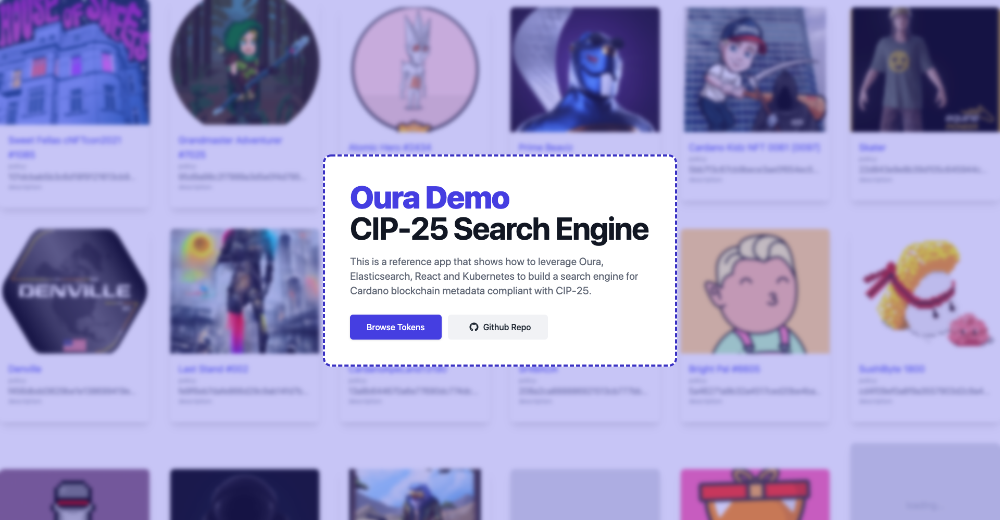
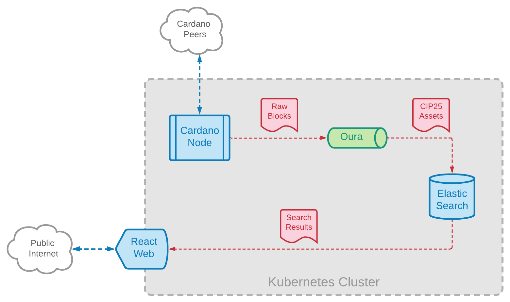

# CIP-25 Search Engine (WIP)

A reference app that uses Oura + Elasticsearch + React to build a Cardano CIP-25 search engine



## Introduction

This is a reference app to show how _Oura_ can be leveradged to build a search engine for CIP-25 tokens.

The frontend is built using React and Remix.

The backend is a combination of a Cardano node, Oura and Elasticsearch.

Everthing is deployed together using Kubernetes

If I missed any buzzwords, let me know :)

## Demo

We have deployed this exact template in our own cloud environment. You are welcome to browse the [live demo](https://cip25-search-engine.txpipe.io/) and provide some feedback.

DISCLAIMER: please be gentle, we're testing as we go. We develop in the open. We believe that the development process is as important as the final result. If you find bugs or improvements, please share back, _ALL_ contributions are welcome.

## Data Flow

The following diagram describes the data flow, starting from the Cardano node, all the way down to the user searching through the web UI.



## Getting Started

### Prerequisites

- K8s Cluster
- Skaffold

### Install Elasticsearch Operator

The Elasticsearch Operator provides some CRDs and controllers to simplify the management of Elasticsearch instances inside a K8s cluster. For more information, please read the [official docs](https://www.elastic.co/guide/en/cloud-on-k8s/current/index.html).

```
kubectl create -f https://download.elastic.co/downloads/eck/1.9.1/crds.yaml
kubectl apply -f https://download.elastic.co/downloads/eck/1.9.1/operator.yaml
```

### Build & Deploy

You can use _Skaffold_ `run` command to build the requried artifacts and deploy them to your current k8s context.

_Skaffold_ is a great tool that provides lots of options. I suggest reading their [excellent docs](https://skaffold.dev/docs/) for fine-tuning the process to your own use-case.

The only component that requires a custom build is the web application. The other components, Elasticsearch & Oura, can be used directly from their publicly-available, already-built Docker images.

```
skaffold run
```

After the scaffold pipeline finishes, you should be able to see the K8s resources for the each fo the required components.

TIP: if you share your k8s cluster with other projects, we recommend using the `--namespace` option in the _Skaffold_ command to put all of the resources under a custom namespace.

### Setup an Index Template

To improve performance and search results, Elasticsearch needs some custom mappings for the index that contains the CIP-25 metadata records.

The required settings are availabe in the `/scripts` folder of the repo. For this to work, you'll need to port-forward the `9200` port from the Elasticsearch instance running in the k8s cluster so that it is accesible at `https://localhost:9200`.

DISCLAIMER: this step of the setup is not very friendly. Using a k8s job or an init-container would be a good way to automate the process. This is part of our TODO list.

```
export ELASTIC_AUTH=user:pass
cd scripts && ./setup-index.sh
```

### Access the Website

The website is deployed as a K8s `deployment` resource named `web`. To _Remix_ server runs in port `3000`. To browse the website locally, you'll need to port-forward the mentioned port for the corresponding pod.

Once done, you should be able to see the landing page of the website by opening `http://localhost:3000` in your local browser.

Initially, you'll probably see few or no results at all. This is because _Oura_ needs some time to index event from the blockchain (see next section).

### Waiting for Data

The configuration used the Oura instance of this template starts starts to index event from slot `50873752`. If want to start indexing from the begining of history, you'll need to adjust the configuration values found in `/k8s/oura.yaml`. For more information on how to configure _Oura_, please check the [documentation](https://txpipe.github.io/oura).

## Local Development

Use the _Skaffold_ `dev` command to deploy a development container of the web app component that watches for local changes in the source-code and re-deployes automatically (_Skaffold_ is really cool).

```
skaffold dev
```

## Out of Scope

Some components of a full-blown version of the system have been left outside of the scope of this template. The rationale is that these components are either:

- probably already available in your setup
- too environment-specific to put inside a template

The missing components are:

- the Cardano node (this template points Oura to a public relay node)
- a load-balancer / ingress controller in front of the website
- SSL encryption (probably offloaded by the load-balancer)
